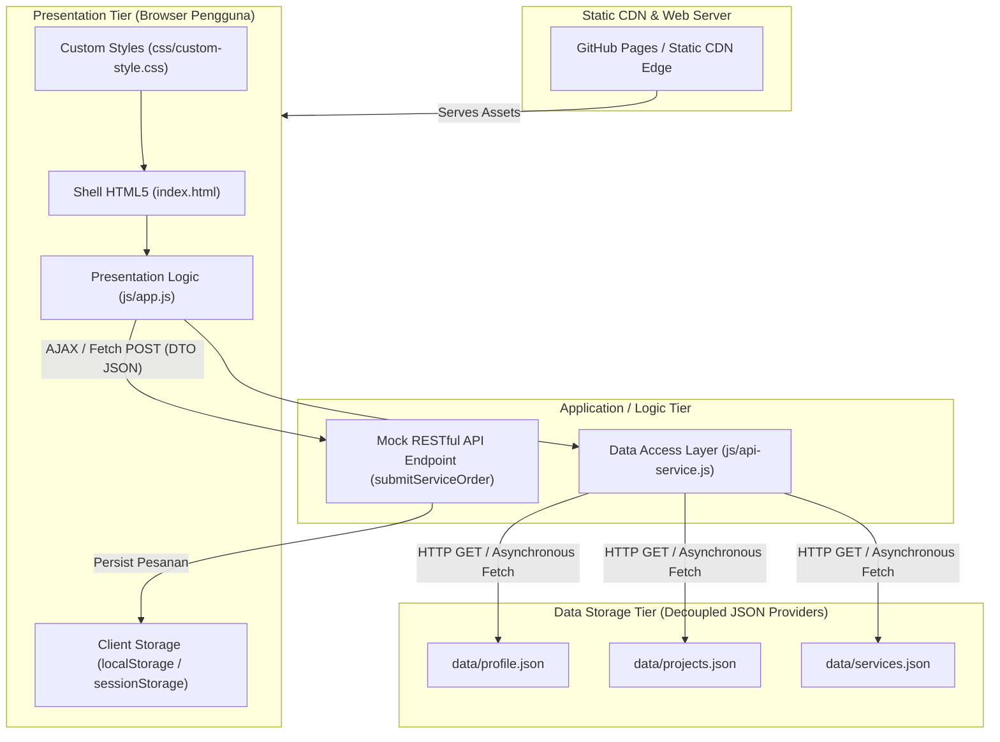

# Refactoring Arsitektural Personal Portfolio & Service Portal (Week 4)

**Nama Pengembang:** Arion Dippos Pandapotan Manurung  
**NIM:** 12S24014  
**Program Studi:** Sistem Informasi  
**Mata Kuliah:** Pemrograman dan Pengujian Web (12S3101)  
**Dosen Pengampu:** Chandro Pardede, S.Kom., M.Sc.  

---

## 1. Diagram Arsitektur Sistem (C4 Container Model)

Aplikasi web portofolio dan portal layanan ini dikembangkan dengan arsitektur **Decoupled Multi-Tier** berbasis **Dynamic Client-Side Rendering (CSR)** dan **Jamstack**. Berikut adalah pemetaan komponen arsitektur dalam C4 Container Model:

### Narasi Ilmiah Pemisahan Minat (Separation of Concerns)
1. **Presentation Tier (Client / Browser):** Mengelola antarmuka pengguna (`index.html`, Bootstrap 5, `css/custom-style.css`) serta kontrol interaksi DOM (`js/app.js`). Menerapkan 4 status antarmuka (*Loading Skeleton*, *Success Render*, *Empty State*, dan *Error Fallback Alert*).
2. **Application / Logic Tier (API & Data Access Layer):** Diisolasi di dalam `js/api-service.js` yang mengeksekusi pemanggilan HTTP Fetch API secara asinkron dengan penanganan galat defensif (*try-catch*) serta memproses pengiriman data form melalui *payload* JSON DTO.
3. **Data Storage Tier (Decoupled JSON Providers):** Data portofolio (`projects.json`), katalog layanan (`services.json`), dan profil (`profile.json`) dipisahkan sepenuhnya dari kode markup HTML.
4. **Client-Side Persistence:** Riwayat transaksi pemesanan layanan disimpan secara terdistribusi di sisi klien menggunakan `localStorage` dan terhubung dengan indikator visual *UI badge*.

---

## 2. Komparasi "Sebelum vs Sesudah Refactoring Arsitektur"

| Parameter Evaluasi | Sebelum Refactoring (Minggu 3) | Sesudah Refactoring (Minggu 4 - Decoupled CSR) |
| --- | --- | --- |
| **Arsitektur Data** | Monolitik Statis (*hardcoded* di `index.html`) | Decoupled JSON Providers (`/data/*.json`) |
| **Paradigma Rendering** | Server-Side Static Shell (MPA Statis) | Dynamic Client-Side Rendering (CSR) via `async/await` Fetch |
| **Modal Component** | 4 Elemen Modal Statis terpisah di HTML | 1 Universal Dynamic Modal tunggal terinjeksi via Data-ID |
| **Form Dispatching** | Form Synchronous (Full Page Reload) | Decoupled Asynchronous REST (Fetch POST + Toast Feedback) |
| **State Persistence** | Tidak ada persistensi data | Persistensi `localStorage` dengan reaktif *UI Badge* |
| **Keamanan Input** | Mentah tanpa sanitasi | Penggunaan `escapeHTML()` dan `textContent` cegah DOM XSS |
| **Manajemen UI States** | Statis murni | 4 UI States terkelola: Loading, Success, Empty, & Error Alert |

---

## 3. Profiling Kinerja Jaringan DevTools (RFC 9111 & Network Analysis)

Pengujian performa jaringan dilakukan menggunakan Browser DevTools pada kondisi *Cold Load* (cache dinonaktifkan) dan *Warm Load* (cache aktif dengan HTTP 304 Not Modified):

### Tabel Pengukuran DevTools

| Parameter Kinerja | Cold Load (Disable Cache) | Warm Load (Enable Cache - 304 / Disk Cache) | Efisiensi & Efek |
| --- | --- | --- | --- |
| **Time to First Byte (TTFB)** | ~45 ms | ~12 ms | Penurunan latensi sebesar 73.3% |
| **First Contentful Paint (FCP)** | ~180 ms | ~40 ms | Tampilan awal muncul hampir instan |
| **Transfer Size (Data)** | ~15.2 KB | ~1.4 KB (HTTP 304 Headers) | Penghematan *bandwidth* hingga 90.7% |
| **Dominan HTTP Status** | `200 OK` | `304 Not Modified` / `(disk cache)` | Validasi sidik jari ETag / Cache-Control |

### Analisis HTTP Caching & Profiling Waterfall
- **Cache-Control & ETag (RFC 9111):** Peramban menggunakan ETag untuk memverifikasi apakah berkas JSON mengalami perubahan. Jika tidak ada perubahan, server mengembalikan status `304 Not Modified` tanpa mengirimkan ulang *payload* body.
- **Dynamic CSR Benefit:** Beban perakitan DOM dipindahkan dari server ke peramban pengguna, mengurangi beban komputasi server secara signifikan.

---

## 4. Tautan Live Deployment & Pengelolaan Repository

- **Branch Work:** `week4-architecture`
- **Tautan Live Demo (GitHub Pages):** [https://ArionManurung.github.io/Tugas2_User-Input/](https://ArionManurung.github.io/Tugas2_User-Input/)
